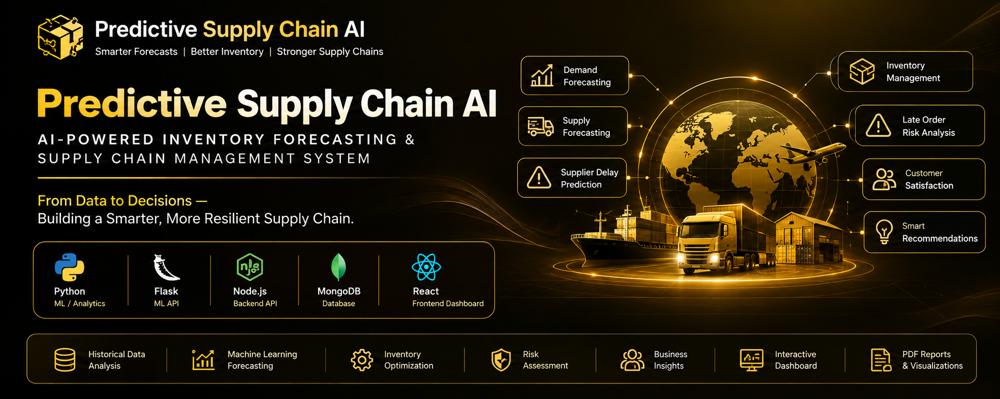
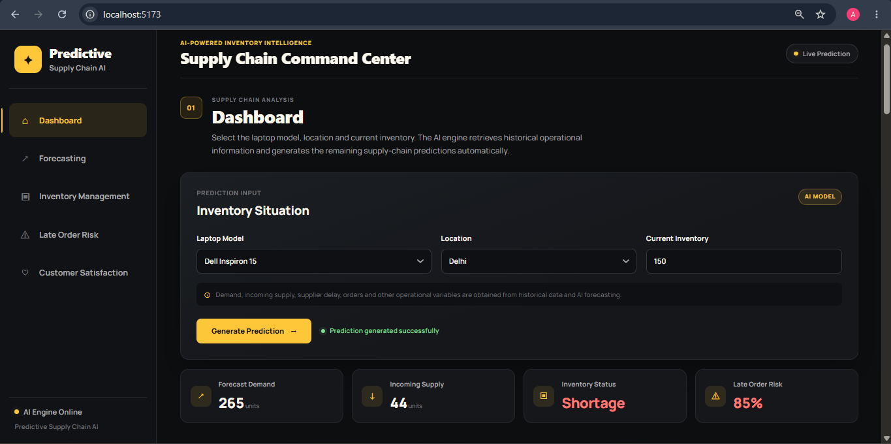
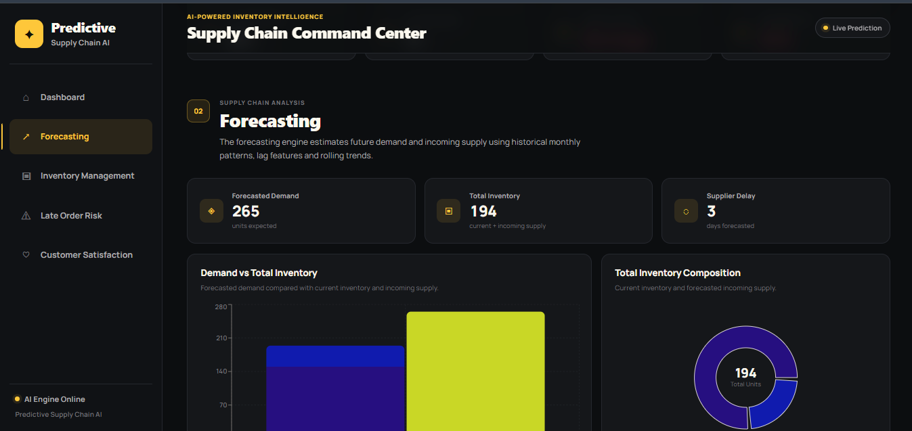
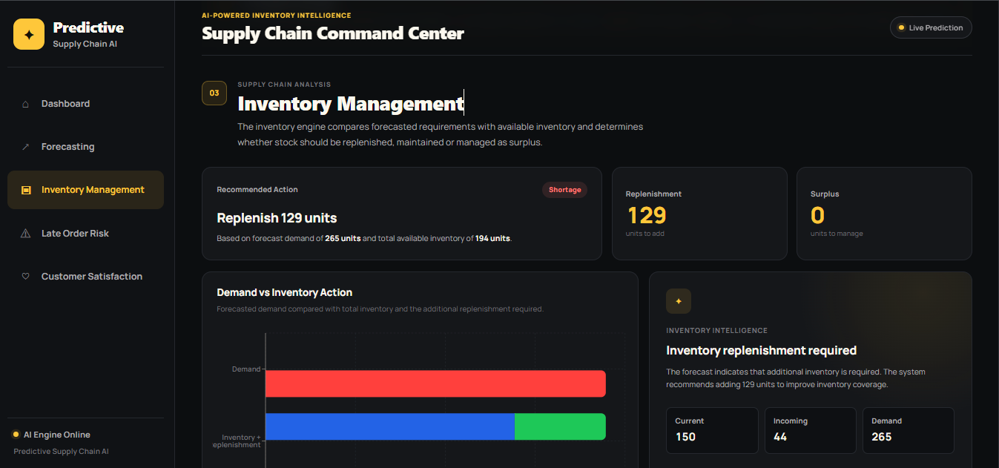
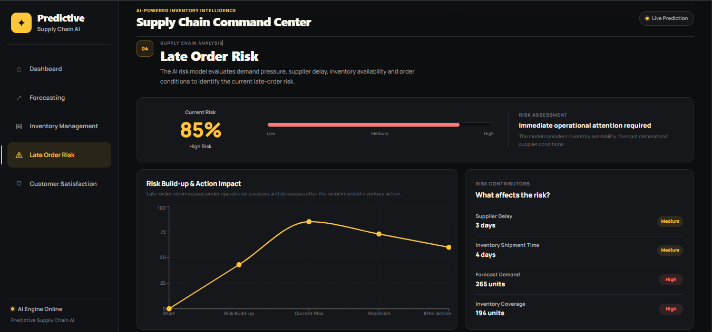
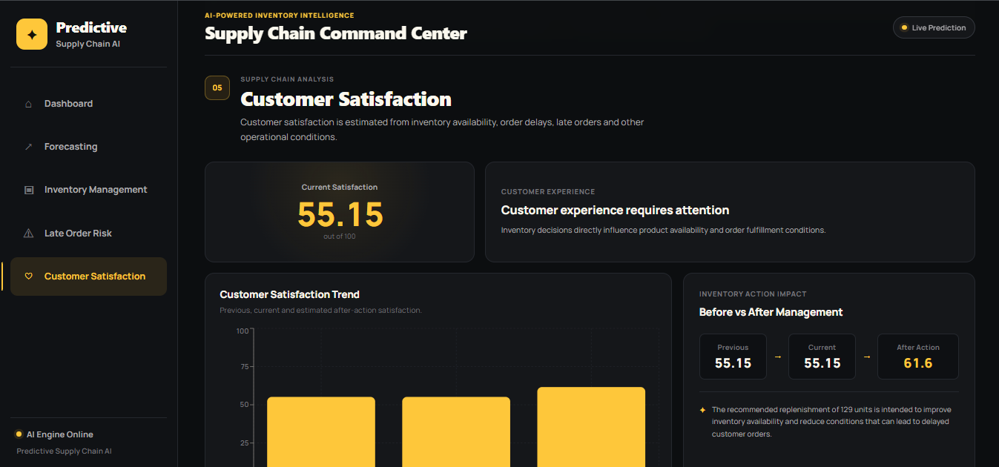

  

Predictive Supply Chain AI

AI-Powered Inventory Forecasting & Supply Chain Management System

Built using Python • Machine Learning • Flask • Node.js • MongoDB • React

📖 Overview

Predictive Supply Chain AI is an AI-powered inventory forecasting and supply-chain management system designed to help businesses make better inventory decisions using historical operational data and machine-learning models.

The system analyzes historical demand, incoming supply, supplier delays, inventory levels, order activity and customer-related operational data to generate future forecasts and actionable inventory recommendations.

Instead of requiring users to manually enter multiple operational variables, the system asks for only the laptop model, location and current inventory. Historical data and the forecasting engine provide the remaining supply-chain information automatically.

The platform is designed around three core business analyses:

Inventory Management

Late Order Risk Analysis

Customer Satisfaction Analysis

These analyses are supported by forecasting and machine-learning models for demand, incoming supply, supplier delay, replenishment, surplus inventory and operational risk.

✨ Key Features

📊 Historical Supply Chain Data Analysis

🔮 Demand Forecasting

📦 Incoming Supply Forecasting

🚚 Supplier Delay Forecasting

🏷️ Inventory Status Classification

🔄 Replenishment Prediction

📈 Surplus Inventory Analysis

⚠️ Late Order Risk Analysis

😊 Customer Satisfaction Prediction

💡 Automated Inventory Recommendations

📉 Risk Build-up & Action Impact Visualization

📊 Interactive Forecasting Charts

🥧 Inventory Composition Visualization

🖥️ React-Based Supply Chain Dashboard

🔌 Flask ML Prediction API

🌐 Node.js / Express Backend API

🗄️ MongoDB Historical & Current Inventory Storage

🎯 Problem Statement

Businesses frequently need to decide:

How much inventory will be required in the future?

Will incoming supply be sufficient?

Are current stock levels too low or too high?

How many units should be replenished?

Is there a high risk of late orders?

How can supplier delays affect order fulfillment?

How might inventory conditions affect customer satisfaction?

Traditional inventory management often depends heavily on manual analysis and fixed thresholds.

This can make it difficult to respond quickly to changing demand, supplier delays and inventory conditions.

Predictive Supply Chain AI addresses this challenge by combining historical supply-chain data, forecasting, machine learning and business decision logic into a single dashboard.

💡 Our Solution

The system follows an end-to-end predictive supply-chain workflow:

Historical Supply Chain Data
            ↓
     Historical Analysis
            ↓
     Demand Forecasting
            ↓
  Incoming Supply Forecasting
            ↓
 Supplier Delay Forecasting
            ↓
     Current Inventory
            ↓
   Inventory Management
      ↙            ↘
Replenishment     Surplus
      ↓              ↓
      └──────┬───────┘
             ↓
    Late Order Risk
             ↓
 Customer Satisfaction
             ↓
   Business Recommendation
             ↓
     React Dashboard

The overall decision process can be summarized as:

IDENTIFY → PREDICT → RECOMMEND

🧠 Predictive Intelligence

The system uses different machine-learning models for different supply-chain tasks.

Inventory Intelligence

The inventory models analyze operational features such as:

Current Inventory

Forecasted Demand

Incoming Supply

Supplier Lead Time

Supplier Delay

Safety Stock

Reorder Level

Stockout History

Laptop Model

Location

The system uses these inputs to determine whether inventory is:

Healthy
Shortage
Surplus

and to calculate the required replenishment or surplus inventory.

Late Order Risk

Late-order risk is analyzed using operational conditions including:

Demand pressure

Inventory availability

Incoming supply

Supplier delay

Supplier lead time

Order activity

Stockout history

The dashboard presents the resulting risk together with the major operational contributors.

Customer Satisfaction

Customer satisfaction is predicted using operational and order-related variables including:

Inventory conditions

Orders

Late orders

Average order delay

Supply-chain conditions

The dashboard also presents a scenario-based after-action estimate to visualize how the recommended inventory action could affect the customer experience.

🏗️ System Architecture

graph TD
    A[Historical Supply Chain Data] --> B[MongoDB]

    B --> C[Historical Analysis]
    C --> D[Forecasting Engine]

    D --> E[Demand Forecast]
    D --> F[Incoming Supply Forecast]
    D --> G[Supplier Delay Forecast]

    H[Current Inventory] --> I[Inventory Intelligence]
    E --> I
    F --> I
    G --> I

    I --> J[Inventory Status]
    I --> K[Replenishment]
    I --> L[Surplus Inventory]

    I --> M[Late Order Risk Model]
    I --> N[Customer Satisfaction Model]

    J --> O[Business Recommendation]
    K --> O
    L --> O
    M --> O
    N --> O

    P[React Dashboard] --> Q[Node.js / Express API]
    Q --> R[Flask ML Service]
    R --> D
    R --> I
    Q --> B

🛠️ Tech Stack

Category

Technologies

Programming Language

Python, JavaScript

Machine Learning

Scikit-learn

ML API

Flask

Backend

Node.js, Express.js

Database

MongoDB

Frontend

React

Data Processing

Pandas, NumPy

Visualization

Recharts

API Communication

REST API, Axios

Forecasting

Historical + lag/rolling feature analysis

Development

VS Code

📊 Dashboard Modules

01 — Dashboard

The main dashboard provides the minimum required input:

Laptop Model

Location

Current Inventory

The AI engine retrieves historical operational information and generates the remaining predictions automatically.

02 — Forecasting

The forecasting module presents:

Forecasted Demand

Total Inventory

Forecasted Supplier Delay

Demand vs Total Inventory

Current Inventory + Incoming Supply composition

03 — Inventory Management

The inventory management module compares forecasted demand with available inventory and determines the required action.

Possible inventory conditions include:

Shortage → Replenish
Healthy  → Maintain
Surplus  → Manage Surplus

04 — Late Order Risk

The late-order risk module displays:

Current Risk Percentage

Risk Level

Risk Build-up

Recommended Action Impact

Supplier Delay

Inventory Shipment Time

Forecast Demand

Inventory Coverage

05 — Customer Satisfaction

The customer satisfaction module displays:

Current Customer Satisfaction Score

Customer Experience Status

Satisfaction Trend

Current vs Previous Score

Scenario-based After-Action Estimate

🚀 How It Works

Step 1 — Select Inventory Context

The user selects:

Laptop Model
Location
Current Inventory

Step 2 — Retrieve Historical Data

The backend retrieves historical supply-chain records stored in MongoDB.

Step 3 — Forecast Future Conditions

The forecasting service estimates:

Future Demand
Future Incoming Supply
Supplier Delay

Step 4 — Analyze Inventory

The ML system compares forecasted requirements with available inventory.

Step 5 — Identify Risk

The system evaluates operational conditions to estimate late-order risk.

Step 6 — Estimate Customer Satisfaction

Order and inventory conditions are used to predict customer satisfaction.

Step 7 — Recommend an Action

The system generates an inventory recommendation such as:

Replenish X units

or

Manage surplus of X units

or

Maintain current inventory

📁 Project Structure

Predictive-Supply-Chain-AI/
│
├── client/
│   ├── src/
│   ├── public/
│   └── package.json
│
├── server/
│   ├── config/
│   ├── models/
│   ├── routes/
│   ├── server.js
│   └── package.json
│
├── ml-service/
│   ├── data/
│   ├── models/
│   ├── app.py
│   └── requirements.txt
│
├── assets/
│   ├── banner.png
│   └── screenshots/
│       ├── dashboard.png
│       ├── forecasting.png
│       ├── inventory-management.png
│       ├── late-order-risk.png
│       └── customer-satisfaction.png
│
├── .gitignore
└── README.md

⚙️ Installation

1. Clone Repository

git clone https://github.com/Ashishkumar217/Predictive-Supply-Chain-AI.git

cd Predictive-Supply-Chain-AI

2. Install Frontend Dependencies

cd client
npm install

3. Install Backend Dependencies

cd ../server
npm install

4. Install ML Dependencies

Create/activate the Python environment used by the ML service and install the dependencies:

cd ../ml-service
pip install -r requirements.txt

▶️ Run the Project

The project uses three services.

Start Flask ML Service

cd ml-service
python app.py

The ML service runs on:

http://localhost:5001

Start Node.js Backend

Open another terminal:

cd server
node server.js

The backend runs on:

http://localhost:5000

Start React Frontend

Open another terminal:

cd client
npm run dev

Then open the localhost URL shown by Vite in your browser.

🔗 API Architecture

React Frontend
      ↓
Node.js / Express
      ↓
MongoDB
      ↓
Flask ML Service
      ↓
Machine Learning Models
      ↓
Prediction + Recommendation
      ↓
Node.js
      ↓
React Dashboard

This separation keeps the frontend, backend, database and machine-learning components independently manageable.

📌 Supported Laptop Models

The current project is designed around laptop inventory management, including:

Dell Inspiron 15

HP Pavilion 15

Lenovo IdeaPad Slim 3

ASUS VivoBook 15

Acer Aspire 5

The system can analyze inventory by both laptop model and location.

🔮 Future Improvements

Potential future improvements include:

Real-time supplier integrations

Real-time order tracking

More advanced time-series forecasting

Automated supplier selection

Multi-warehouse optimization

Dynamic safety-stock optimization

Real-time inventory alerts

Explainable AI for individual predictions

Automated inventory redistribution between locations

Production-scale monitoring and model retraining

👨‍💻 Developer

Ashish Kumar

Predictive Supply Chain AI combines machine learning, forecasting and full-stack development to transform historical supply-chain data into actionable business intelligence.

⭐ Project

If you find this project useful, consider giving the repository a ⭐ on GitHub.

  <b>Predict smarter. Manage inventory better. Build a stronger supply chain.</b>

